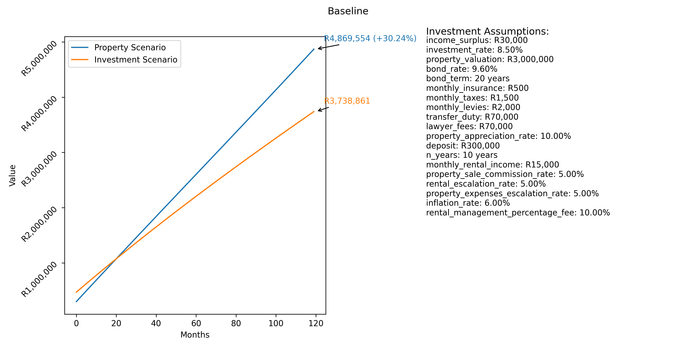

# Forecast

Forecast is a Python package for comparing investment scenarios. It forecasts the total value of investments in property and a low-cost index fund over a certain period.

*“All models are wrong, some are useful.”* This model is certainly wrong and oversimplified, but aspires to be at least a little useful.




## Installation

```
# install with the ability to modify
pip install --editable .

# run baseline forecast scenarios
python -m forecast.main
```

## Forecast Assumptions

The package uses a set of assumptions to model the investment scenarios. These assumptions include:

- **Income Surplus**: The amount of monthly income available for investment.
- **Investment Rate**: The expected annual return rate in the stock market.
- **Property Valuation**: The initial value of the property.
- **Bond Rate**: The annual interest rate of the bond.
- **Bond Term**: The term of the bond in years.
- **Monthly Insurance**: The monthly cost for home owner's insurance.
- **Monthly Taxes**: The monthly cost for property taxes.
- **Monthly Levies**: The monthly cost for levies.
- **Transfer Duty**: One-time cost for transfer duty.
- **Lawyer Fees**: One-time cost for lawyer's fees.
- **Property Appreciation Rate**: The expected annual property appreciation rate.
- **Deposit**: The initial deposit for the property.
- **Monthly Rental Income**: The monthly rental income from the property.
- **Property Sale Commission Rate**: The commission percentage for property sale.
- **Rental Escalation Rate**: The annual escalation rate for rental.
- **Property Expenses Escalation Rate**: The annual escalation rate for property expenses.
- **Inflation rate**: Assumed annual inflation rate used to calculate the real value of investments.
- **Rental management percentage fee**: The (optional) percentage of the coming year's total rental income charged by the agent for procurement and management.

## Scenarios Compared

The package compares the following scenarios:

1. **Property Investment Scenario**: In this scenario, the income surplus is used to pay for the monthly bond repayment, property-related expenses, and any additional investment into the property. The property is assumed to appreciate at a given rate, while property expenses and rental income escalate annually. The value of the property investment is calculated monthly, taking into account the outstanding bond balance and any selling commission.

2. **Stock Market Investment Scenario**: In this scenario, the income surplus is invested monthly into a low-cost index fund, assumed to provide a certain annual return rate. The value of the stock market investment is calculated monthly, with reinvestment of returns.

These scenarios provide a comparative analysis of investing in property versus the stock market over a certain period, given a set of investment assumptions.
